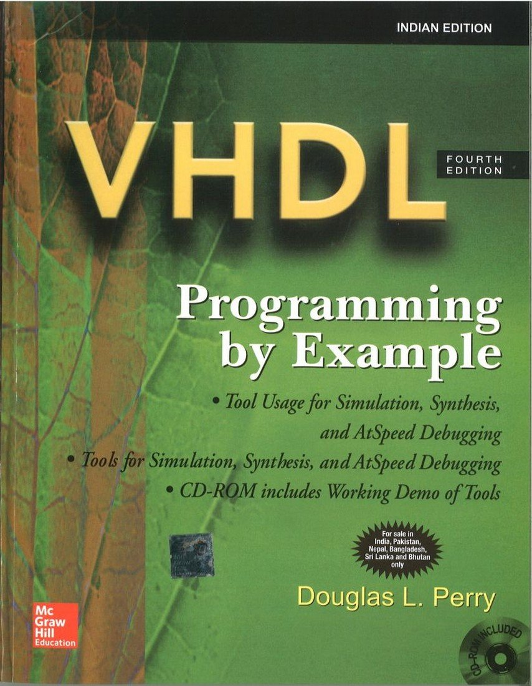

# CPU Design

## Description

The example is a small, 16-bit microprocessor.

The processor contains a number of basic pieces. There is a register
array of eight 16-bit registers, an ALU (Arithmetic Logic Unit), a shifter,
a program counter, an instruction register, a comparator, an address register, and a control unit. All of these units communicate through a common, 16-bit tristate data bus.

## References

- [VHDL Programming by Example - PDF Book](./Resources/VHDL%20Programming%20by%20Example.pdf)
